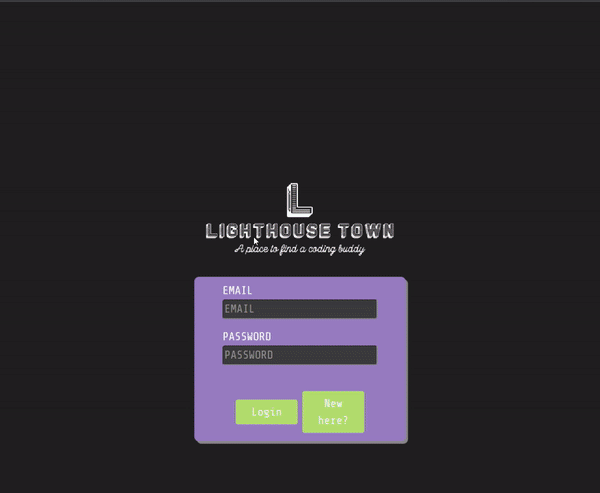
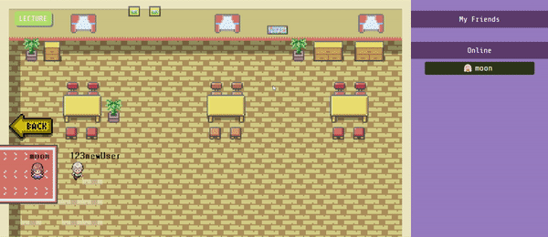
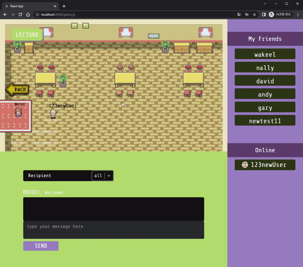
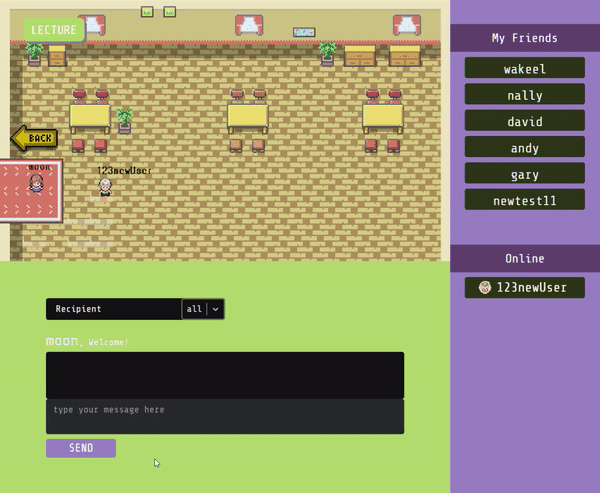

# Lighthouse Town

## About 
A Retro gaming inspired online chatting app - focused on bringing developers and collaborators together. \
Built with React.js, Socket.IO, React Router and Express Node.js

## Collaborators
* Myeonghwan Mike Yun: https://github.com/mikyYun
* Moon Choi: https://github.com/moon-choi
* Heesoo Park: https://github.com/IamHPark
* Jordan Ciurcovich: https://github.com/symphony

## Preview
* Lighthouse Town Plaza - see other users online  

* Login  

* Registration  

* Share Video via lecture button  

* Synced Video  

* Chat to All with bubble over avatar  

* Private chat any location  

## Features
- login with existing userdata
- register with unique email and username
- choose their programming languages and avatar in registeration
- see other online users
- control their own avatar
- see other online users' movement
- communicate to all 
- communicate to specific user
- share video link in js room via lecture button
- User cannot see unrelated private messages
- see public messages over the head of avatar
- see online users list and friends list
- add a friend by click 'Add frined' on online list 
- see online user's information by click 'View profile' on online list's user tag
- send message by click 'Send message' on online list's user tag

---
## Usage
- Clone and cd into repo \
`git clone git@github.com:mikyYun/lighthouse_town.git && cd lighthouse_town`

### Server Setup
- `cd server` 
- `npm i` in **server** folder to install server dependencies
- `cp .env.example .env` to create environment variables file

### Database
- login to psql as any admin \
`postgres psql`

- create 'development' superuser \
`CREATE USER development WITH SUPERUSER PASSWORD 'development';` \
`\du` => check new user

- create new database \
`CREATE DATABASE coding_buddy_development;` \
`\l` => check new database

- login with new user
`psql -d coding_buddy_development -U development` \

- enter password `development` to login \
`\conninfo` => check current user

### Client Setup
- `cd client` (from **root** folder) 
- `npm i` in **app** folder
- `cp .env.example .env`

### Troubleshooting
- initialize the database \
`npm run db:reset` in **server** folder
- `ctrl + C` to stop the server or client

### Run the App
- run server and client together from **server** folder \
`npm run runall`

- *OR* run server individually \
`npm run dev` from **server** folder

- run client \
`npm start` from **app** folder
